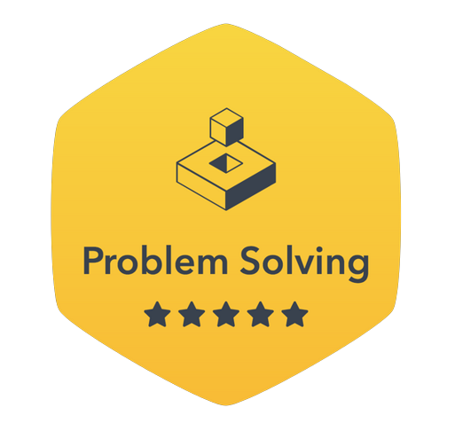
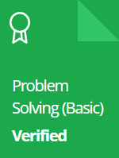
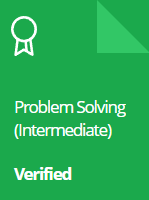

# JavaScript-Solutions

>**목적** : 여러 코딩 문제 사이트를 통한 코딩 테스트 준비 & 알고리즘 공부

- **HR** : HackerRank
- **BJ** : BaekJoon
- **PM** : ProgramMers
- **CT** : CodingTest

## 🏆 Badges

> **hackerrank**

## 🎓 Certificates

> **hackerrank**

  
   👈 Click the icons

